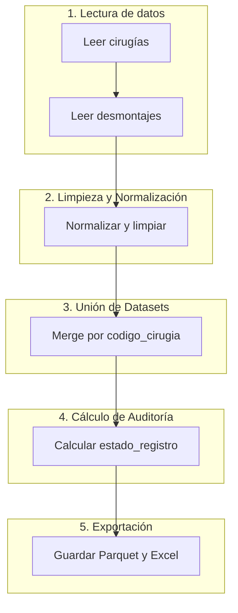

# 📊 Proyecto PLAN PONS - Análisis de Cirugías y Consumos

Este proyecto tiene como objetivo unir y auditar la información proveniente del **Maestro de Cirugías** y el **Maestro de Desmontaje**, con foco en trazabilidad, control de stock y eficiencia operativa.

---

## 🏗️ Estructura

```
PLAN PONS/
├── data/                    # Archivos originales limpios
├── output/                  # Resultados del merge y análisis
├── src/                     # Scripts de procesamiento
├── main.py                  # Script principal del pipeline
├── .gitignore
└── README_2_estado_registro.md
```

---

## 🔁 Proceso

1. **Limpieza de datos**  
   Estándar de columnas y normalización.

2. **Merge y auditoría**  
   Unión por `codigo_cirugia` y generación del campo `estado_registro`.

3. **Generación de outputs**  
   Se exporta a `.parquet` y `.xlsx` en `/output/`.

---

## 🗺️ Diagrama de flujo del pipeline



---

## 📌 Estado de los registros

Ver [README_2_estado_registro.md](./README_2_estado_registro.md) para conocer el significado de cada valor en `estado_registro`.

---

## 👤 Autor

Juan Miguel Gigante  
SAI  
📧 juangigante@saimedicine.com

